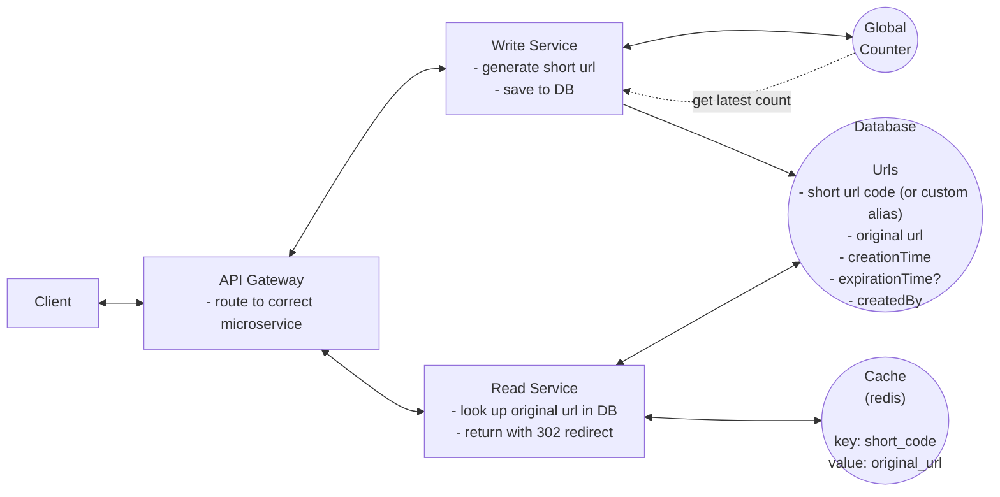

# URL Shortener

**This project is a work in progress.**

This is a simple URL shortener application built with golang. It allows users to shorten long URLs and provides a unique short URL that redirects to the original URL.

## Overall Architecture

For detailed architecture information, please refer to the [Architecture](docs/architecture.md) document.

## Core Features

1. **Shorten URLs**: Users can input a long URL and receive a shortened version that is easier to share.
2. **Redirect to Original URL**: When a user visits the shortened URL, they are redirected to the original long URL.
3. **Custom Short URLs**: Users can create custom short URLs instead of random ones.
4. **Optional Expiration**: Users can set an expiration date for the shortened URL, after which it will no longer be valid.

# Out of Scope Features

1. **Authentication**: The application does not include user authentication or account management.
2. **Analytics**: There are no analytics or tracking features for the shortened URLs.

## Non-Functional Requirements

1. **Uniqueness**: The system should ensure uniqueness for the short codes (each short code maps to exactly one long URL)
2. **Performance**: The redirection should occur with minimal delay (< 100ms)
3. **Availability**: The system should be reliable and available 99.99% of the time (availability > consistency)
4. **Scalability**: The system should scale to support 1B shortened URLs and 100M DAU

## Out of Scope Non-Functional Requirements

1. **Security**: The application does not include advanced security features such as encryption or protection against malicious URLs.
2. **Rate Limiting**: There are no rate limiting or abuse prevention mechanisms in place.
3. **Monitoring**: The application does not include monitoring or logging features for tracking usage or performance.

> The project is designed to be a simple and lightweight URL shortener, focusing on core functionality while leaving out advanced features that may be required in a production environment. This is intentionally done to keep the project simple and easy to understand for educational purposes.

**Note**: Requirements are subject to change based on user feedback and evolving needs.

## Implementation Details
| Component | Technology |
|-----------|------------|
| **Language** | [Golang](https://golang.org/) |
| **Database** | [PostgreSQL](https://www.postgresql.org/) |
| **Cache** | [Redis](https://redis.io/) |

Built with ❤️ by [Bijay Sharma](https://bijay.dev)
