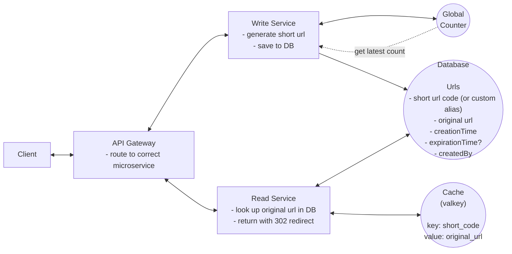

# Architecture

```mermaid
graph LR
    Client["Client"]
    Gateway["API Gateway<br/>- route to correct microservice"]
    Write["Write Service<br/>- generate short url<br/>- save to DB"]
    Read["Read Service<br/>- look up original url in DB<br/>- return with 302 redirect"]
    Counter(("Global<br/>Counter"))
    DB(("Database<br/><br/>Urls<br/>- short url code (or custom alias)<br/>- original url<br/>- creationTime<br/>- expirationTime?<br/>- createdBy"))
    Cache(("Cache<br/>(valkey)<br/><br/>key: short_code<br/>value: original_url"))

    Client <--> Gateway
    Gateway <--> Write
    Gateway <--> Read
    Write <--> Counter
    Write --> DB
    Read <--> DB
    Read <--> Cache

    Counter -.->|"get latest count"| Write
```
